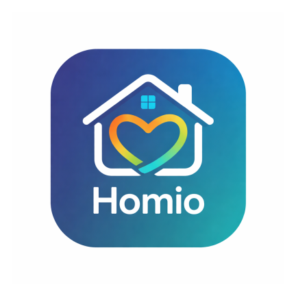

<p align="center">
  
</p>

<h1 align="center">Homio</h1>

<p align="center">
Homio is an Android application designed to manage hostels in educational institutions.  
It provides two roles — Students and Wardens — to digitally handle hostel allocation, student details, and administration.
</p>

<div align="center">
  <a href="https://github.com/saumyaoj04/Homio/releases">
    
  </a>
  <a href="https://github.com/saumyaoj04/Homio/releases/latest">
    
  </a>
  <a href="https://github.com/saumyaoj04/Homio/blob/main/LICENSE">
    
  </a>
  
</div>

---

## 🔧 Tech Stack

- **Kotlin** – Android development
- **Firebase Authentication** – Student authentication
- **Shared Preferences** – Warden login & local storage
- **Room Database** – Hostel, room, and student data
- **Splash Screen API** – App launch screen
- **ViewPager** – Banner carousel
- **Material Design 3** – Modern UI & UX

---

## 📦 Installation

To run the application locally:

1. Clone the repository:
   ```bash
   git clone https://github.com/saumyaoj04/Homio.git
2. Open the project in Android Studio 
3. Create a new Firebase Project 
4. Add an Android app with package name:
   com.saumya.homio 
5. Download google-services.json 
6. Place it inside:
   app/google-services.json 
7. Sync Gradle and run the app on an emulator or physical device

⬇️ Download

Go to Releases to download the APK:

👉 https://github.com/saumyaoj04/Homio/releases

(Release APK will appear after you upload a signed build)

📸 Screenshots
Splash Screen | Home | Home (Light)
Splash Screen	Home	Home (Light)


Student Login | Student Register | Student Dashboard (Light)
Student Login	Student Register	Student Dashboard


Student Dashboard Form | Student Basic Details | Student Final Details
Room Selection	Basic Details	Final Details


🤝 Contributing

Contributions are welcome!
If you find a bug or want to improve the app, feel free to open an issue or submit a pull request.

👤 Author

Saumya Ojha
Android Developer | Kotlin | Firebase

GitHub: https://github.com/saumyaoj04